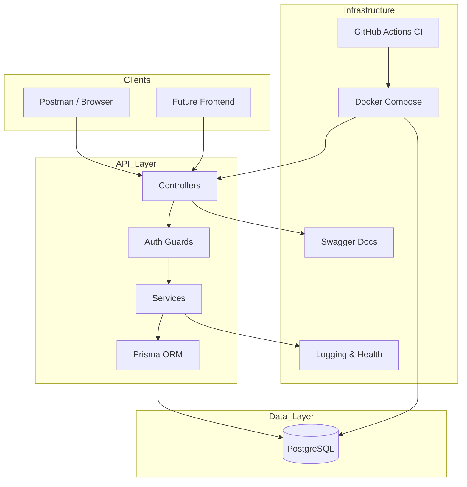

# TalentFlow System Architecture



---

# Expanded Logical View

## Request Flow

```
Client
  → Controller
     → Guard (JWT/RBAC)
        → Service (business logic)
           → Prisma
              → PostgreSQL
```

---

# Component Responsibilities

## Client Layer

### Postman / Browser

* consumes REST APIs
* sends JWT tokens

---

## API Layer (NestJS)

### Controllers

* HTTP routing
* input validation
* response formatting

### Guards

* JWT authentication
* role authorization

### Services

* matching logic
* CRUD
* business rules

### Prisma ORM

* typed queries
* migrations
* DB abstraction

---

## Data Layer

### PostgreSQL

Stores:

* users
* developers
* clients
* skills
* projects
* matches
* contracts

---

## Infrastructure Layer

### Docker Compose

Runs:

* API container
* Postgres container

### GitHub Actions

* install
* test
* build

### Swagger

* API documentation

### Logging + Health

* `/health`
* request logging

---

# Deployment View (Runtime)

You effectively run:

```
┌──────────────────────┐
│ talentflow-api       │
│ NestJS container     │
└─────────┬────────────┘
          │
          ▼
┌──────────────────────┐
│ PostgreSQL container │
└──────────────────────┘
```

Both orchestrated by:

```
docker compose up
```

---

# Architecture Characteristics

## Style

Layered Monolith (Modular Monolith)

## Why

* simple deployment
* easier debugging
* perfect for MVP
* scalable later

---

# Scalability Strategy

Future upgrade path:

```
API → Redis cache
API → Load balancer
API → microservices split
DB → read replicas
```

---

# Interview Talking Points

This diagram demonstrates:

* separation of concerns
* stateless API
* containerization
* clean layering
* production readiness

These are strong **senior backend signals**.

---

# Documentation Set (Recommended)

Your project should now have:

```
docs/
  FRD.md
  TDD.md
  openapi.yaml
  er-diagram.md
  architecture.md
```

This is equivalent to real-world backend project documentation.

---

If useful, next I can generate:

* sequence diagram (login flow)
* sequence diagram (matching flow)
* deployment diagram (cloud)
* or test strategy document

Choose one.
