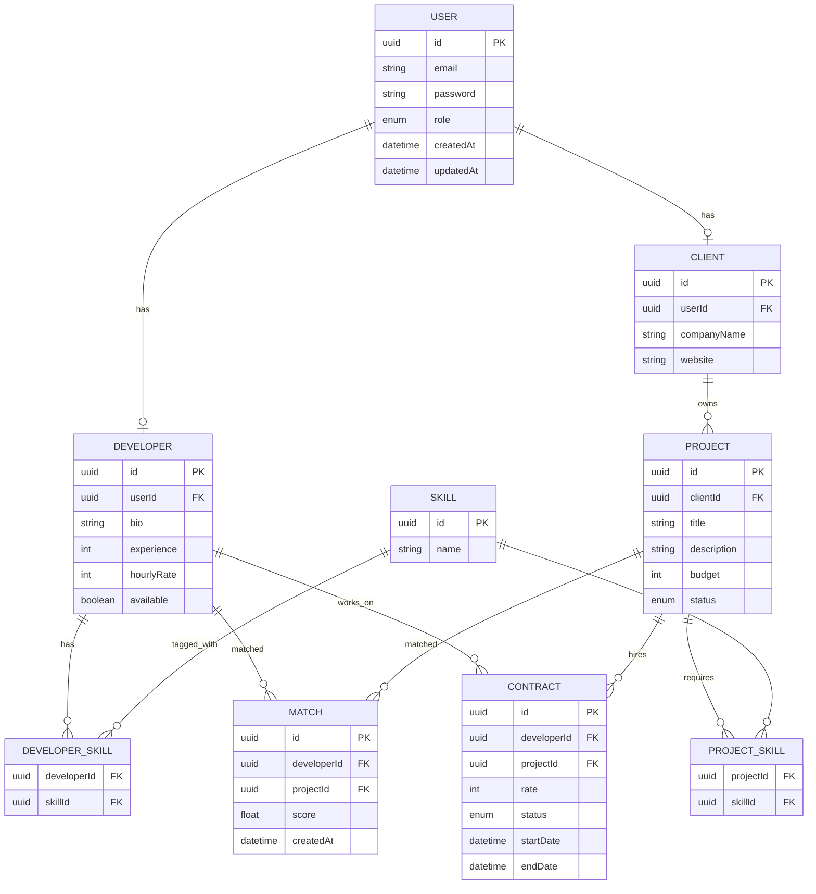

# ER Diagram (Mermaid)



---

# Visual Structure (Conceptual)

### Core Identity

```
User
 ├── Developer
 └── Client
```

### Skills

```
Developer ↔ Skill (many-to-many)
Project   ↔ Skill (many-to-many)
```

### Business

```
Client → Projects
Project ↔ Developer (Match)
Project ↔ Developer (Contract)
```

---

# Design Rationale

## User separation

Profiles split:

* auth logic stays in User
* domain data stays in Developer/Client

This is a standard **enterprise polymorphic pattern**.

---

## Normalized Skills

Instead of arrays:

```
skills: string[]
```

We use:

```
Skill + join tables
```

Benefits:

* indexed search
* filtering
* scalability
* better matching queries

---

## Match table

Stores:

* computed score
* history
* ranking

Avoids recomputing matches every request.

This is a **senior-level architecture decision**.

---

## Contract table

Represents real hiring lifecycle:

```
PENDING → ACTIVE → ENDED
```

Keeps business logic explicit.

---
